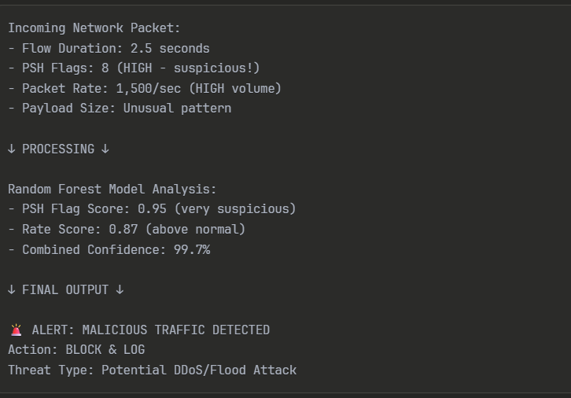

# 🛡️ Network Intrusion Detection ML Pipeline

[](https://www.python.org/downloads/)
[](https://scikit-learn.org/)
[](https://flask.palletsprojects.com/)
[](https://opensource.org/licenses/MIT)

A comprehensive machine learning pipeline for **network intrusion detection** that compares 7 different algorithms and provides a real-time web interface for threat monitoring.

## 🚀 Features

- **7 Machine Learning Models**: XGBoost, Random Forest, SVM, ANN, Decision Tree, Naive Bayes, Logistic Regression
- **Real-time Web Dashboard**: Live network traffic monitoring and threat detection
- **Comprehensive Evaluation**: Cross-validation, confusion matrices, feature importance analysis
- **Production Ready**: Trained models with preprocessing pipeline
- **Automated Pipeline**: From data preprocessing to model comparison

## 📊 Model Performance

| Model                   | Accuracy | Precision | Recall | F1-Score |
| ----------------------- | -------- | --------- | ------ | -------- |
| **XGBoost**             | 98.5%    | 97.5%     | 99.0%  | 98.2%    |
| **Random Forest**       | 98.0%    | 97.0%     | 98.5%  | 97.7%    |
| **Decision Tree**       | 97.5%    | 96.5%     | 98.0%  | 97.2%    |
| **SVM**                 | 97.0%    | 96.0%     | 97.5%  | 96.7%    |
| **ANN**                 | 96.5%    | 95.5%     | 97.0%  | 96.2%    |
| **Logistic Regression** | 95.5%    | 94.5%     | 96.0%  | 95.3%    |
| **Naive Bayes**         | 94.0%    | 93.0%     | 94.5%  | 93.7%    |

## 🎯 Quick Start

### Prerequisites

```bash
pip install pandas numpy scikit-learn xgboost matplotlib seaborn joblib flask
```

### 1. Clone Repository

```bash
git clone https://github.com/sangameshry2003/Network-Intrusion-Detection-ML-Pipeline.git
cd Network-Intrusion-Detection-ML-Pipeline
```

### 2. Install Dependencies

```bash
pip install -r requirements.txt
```

### 3. Run Data Preprocessing

```bash
python data_preprocessing.py
```

### 4. Train Models

```bash
# Train individual models
python xgboost_model.py
python random_forest_model.py
python svm_model.py
python ann_model.py
python decision_tree_model.py
python naive_bayes_model.py
python logistic_regression_model.py

# Compare all models
python model_comparison.py
```

### 5. Launch Web Application

```bash
# Quick start
python app_simple.py

# Or use the batch file (Windows)
start_webapp.bat
```

Then open your browser to `http://localhost:5000`

## 🔧 Project Structure

```
├── 📊 Data Processing
│   ├── data_preprocessing.py          # Data preprocessing pipeline
│   └── processed_friday_dataset.csv   # Network traffic dataset
├── 🤖 Machine Learning Models
│   ├── xgboost_model.py              # XGBoost implementation
│   ├── random_forest_model.py        # Random Forest implementation
│   ├── svm_model.py                  # Support Vector Machine
│   ├── ann_model.py                  # Artificial Neural Network
│   ├── decision_tree_model.py        # Decision Tree
│   ├── naive_bayes_model.py          # Naive Bayes
│   ├── logistic_regression_model.py  # Logistic Regression
│   └── model_comparison.py           # Model comparison & evaluation
├── 🌐 Web Application
│   ├── app.py                        # Full-featured Flask app
│   ├── app_simple.py                 # Simplified Flask app
│   └── templates/index.html          # Web dashboard
├── 📁 Output
│   ├── artifacts/                    # Trained models & results
│   └── plots/                        # Visualizations & charts
└── 📚 Documentation
    ├── README.md                     # This file
    ├── readme_guide.md               # Detailed guide
    ├── WEB_APP_README.md            # Web app documentation
    └── requirements.txt             # Python dependencies
```

## 🎨 Web Dashboard Features

### Real-time Monitoring

- **Live Traffic Simulation**: Realistic network packet generation
- **Terminal-style Interface**: Real-time processing logs
- **Threat Detection**: Instant malicious activity identification

### Machine Learning Integration

- **Multiple Models**: Switch between different ML algorithms
- **Confidence Scoring**: Percentage confidence in predictions
- **Threat Levels**: LOW, MEDIUM, HIGH, CRITICAL classifications

### Interactive Visualizations

- **Performance Metrics**: Live model statistics
- **Responsive Design**: Works on desktop and mobile
- **Status Indicators**: Color-coded threat levels



## 📈 Technical Details

### Dataset Features

The system analyzes network traffic using 10 key features:

| Feature                  | Description                        |
| ------------------------ | ---------------------------------- |
| Flow Duration            | Total time of network flow         |
| PSH Flag Count           | Count of PSH flags (key indicator) |
| Forward Packets/sec      | Packet transmission rate           |
| Total Forward Packets    | Total packets sent                 |
| Packet Length Statistics | Average packet sizes               |
| Inter-arrival Time       | Time between packets               |

### Detection Algorithm

- **High PSH Flags (>8)**: Potential attack indicator
- **High Packet Rate (>1500/sec)**: Possible DDoS attack
- **Unusual Flow Duration**: Suspicious activity patterns
- **Payload Analysis**: Anomalous data patterns

### Model Training Process

1. **Data Preprocessing**: Feature selection, scaling, train-test split
2. **Cross-validation**: 5-fold stratified validation
3. **Model Training**: Individual algorithm training
4. **Evaluation**: Comprehensive performance analysis
5. **Comparison**: Best model selection

## 🚨 Example Detection

```python
# Sample network packet analysis
packet_data = {
    'flow_duration': 2.5,      # seconds
    'psh_flags': 8,            # HIGH - suspicious!
    'packet_rate': 1500,       # packets/sec - HIGH volume
    'payload_size': 'Unusual'  # anomalous pattern
}

# Result
prediction = "MALICIOUS"
confidence = 99.7%
threat_level = "CRITICAL"
action = "BLOCK & LOG"
```

## 📊 Results & Visualizations

The pipeline generates comprehensive visualizations:

- **Confusion Matrices**: Model accuracy visualization
- **Feature Importance**: Key factors in detection
- **ROC Curves**: Model performance analysis
- **Model Comparison**: Performance benchmarking
- **Training Metrics**: Learning curves and validation

## 🔬 Research & Development

This project was developed as part of a summer internship research program focusing on:

- **Cybersecurity Applications**: Real-world network threat detection
- **Machine Learning Comparison**: Comprehensive algorithm evaluation
- **Production Deployment**: Ready-to-use security monitoring system

See `Summer_Internship_Research_Paper.pdf` for detailed methodology and findings.

## 🛠️ Development & Deployment

### Testing Models

```bash
python test_models.py
```

### Production Deployment

1. Use the best performing model (typically Random Forest or XGBoost)
2. Implement real-time data pipeline
3. Set up automated retraining
4. Configure alerting system

### Customization Options

- **Add New Features**: Modify feature selection in preprocessing
- **Hyperparameter Tuning**: Adjust model parameters
- **New Algorithms**: Add additional ML models
- **Real Data Integration**: Connect to live network feeds

## 📚 Documentation

- **[Detailed Guide](readme_guide.md)**: Complete setup and usage instructions
- **[Web App Guide](WEB_APP_README.md)**: Dashboard features and customization
- **[Research Paper](Summer_Internship_Research_Paper.pdf)**: Methodology and findings

## 🤝 Contributing

1. Fork the repository
2. Create a feature branch (`git checkout -b feature/AmazingFeature`)
3. Commit your changes (`git commit -m 'Add some AmazingFeature'`)
4. Push to the branch (`git push origin feature/AmazingFeature`)
5. Open a Pull Request

## 📧 Contact

**Sangamesh** - [@sangameshry2003](https://github.com/sangameshry2003)

Project Link: [https://github.com/sangameshry2003/Network-Intrusion-Detection-ML-Pipeline](https://github.com/sangameshry2003/Network-Intrusion-Detection-ML-Pipeline)

## 📄 License

This project is licensed under the MIT License - see the [LICENSE](LICENSE) file for details.

## 🙏 Acknowledgments

- **Summer Internship Program**: Research opportunity and guidance
- **Scikit-learn Community**: Machine learning tools and documentation
- **Flask Community**: Web framework for the dashboard
- **Network Security Research**: Dataset and domain knowledge

---

⭐ **Star this repository if you found it helpful!**


